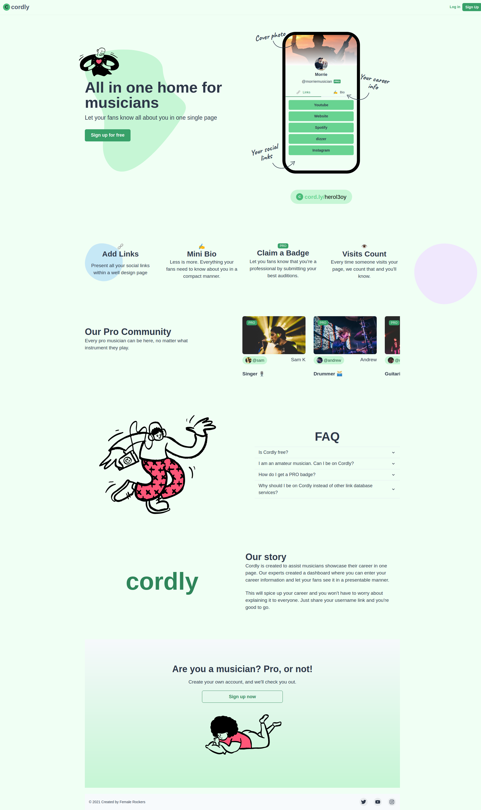
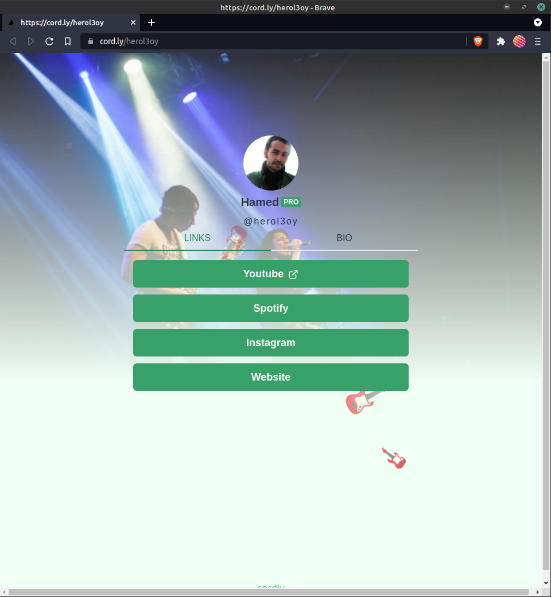
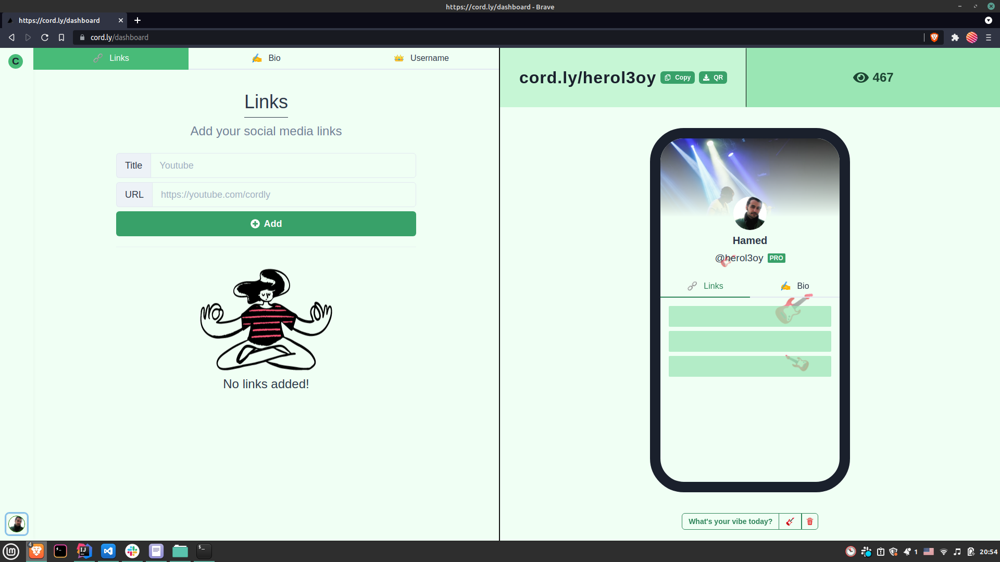
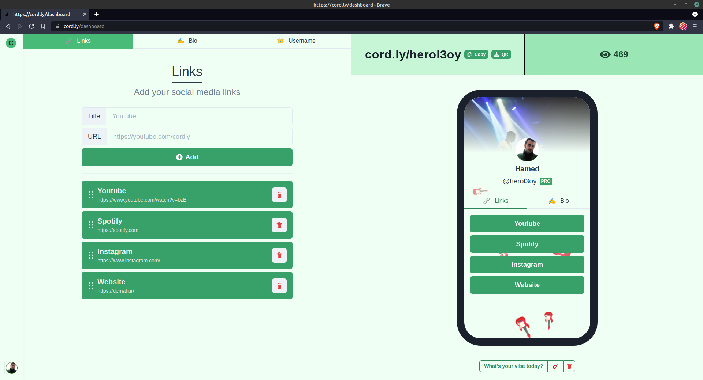
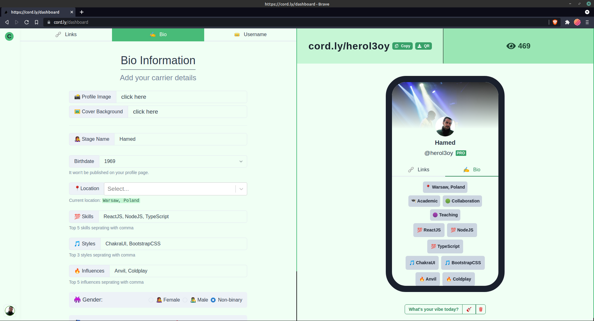

# 🎵 Cordly

Cordly is an online platform specifically designed for musicians to create personalized mini portfolios, showcase their work, and connect with other musicians based on their location, interests, influences, and skills. It serves as a virtual hub where musicians can highlight their talent, share their social links, and discover like-minded artists in their community.

### Tech stacks

- Frontend
  - [ReactJS](https://reactjs.org/)
  - [NextJS](https://nextjs.org/)
  - [Chakra UI](https://chakra-ui.com/)
- Backend
  - [Firebase](https://firebase.com)

## Getting started

```bash
    git clone https://github.com/herol3oy/cordly.git
    cd cordly
    yarn && yarn dev
```

### Screenshots

<p align='center'>
    <h1>Homepage</h1>
    
</p>
<p align='center'>
    <h1>User Profile</h1>
    
</p>
<p align='center'>
    <h1>Dashboard without Social Media Links Added</h1>
    
</p>
<p align='center'>
    <h1>Dashboard with Social Media Links Added</h1>
    
</p>
<p align='center'>
    <h1>Dashboard - Bio Tab</h1>
    
</p>
